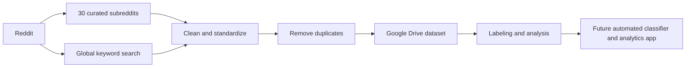

# WorkEnablr Reddit Research Pipeline

An automated system for finding Reddit conversations that can help WorkEnablr understand how people experience project execution, coordination, visibility and cross-tool work.

This repository contains the **data-collection layer** of the wider Reddit research project. It continuously collects new Reddit posts, removes duplicates and stores the resulting dataset in Google Drive for later labeling, analysis and model training.

## Why this project exists

Teams often discuss real workflow problems on Reddit before those problems ever appear in a formal customer interview or product survey.

The research has three main goals:

1. **Product research**  
   Understand recurring pain points around blockers, dependencies, ownership, status visibility, lost decisions, fragmented information and delivery risk.

2. **Competitive insight**  
   Learn where people struggle while using tools such as Jira, Slack, Notion, GitHub, Confluence, Asana, ClickUp, Linear and similar products.

3. **Community research**  
   Identify conversations where WorkEnablr's problem space is already being discussed, so the team can better understand the language, needs and situations of potential users.

The scraper itself **does not post or comment on Reddit**. It only reads public posts and builds a research dataset.

## How it works

The system uses two independent ways of finding posts.

### 1. Curated subreddit collection

The project follows **30 selected Reddit communities** related to project management, engineering management, software development, operations and work-management tools.

Every **12 hours**, the scraper checks these communities and collects **all posts from the previous 13 hours**.

The extra hour creates overlap between runs so that a small delay in GitHub Actions does not automatically create a gap in the data.

Posts from these 30 communities do **not** need to contain a keyword. The idea is to keep broad coverage inside communities that are already relevant to the research.

### 2. Global Reddit search

Every **3 hours**, a second workflow searches across Reddit for conversations outside the curated communities.

The global search looks for posts containing:

- at least one configured **pain/problem term**, and
- at least one configured **work-tool term**.

Examples of pain terms include *blocked*, *dependencies*, *handoff*, *ownership*, *source of truth*, *visibility*, *action items* and *fragmented*.

Tracked tool terms currently include:

`Jira`, `Slack`, `Notion`, `GitHub`, `Confluence`, `Asana`, `Monday`, `ClickUp`, `Linear`, `Teams`, `spreadsheet` and `email`.

The 35 pain terms are divided into **7 search queries**. Each query asks Reddit for up to **250 of its newest search results** before the local time and keyword checks are applied. Reddit does not guarantee that every query will return exactly 250 results.

Every global-search candidate is then checked again locally. A post is kept only when its own title or body contains at least one configured pain term and at least one configured tool term.

## What happens before a post is stored

Both collection streams eventually pass through the same safeguards:

1. The post is converted into one consistent dataset format.
2. Its Reddit ID is checked against the existing dataset.
3. Its non-empty body text is also checked for an exact duplicate.
4. Duplicates inside the same new batch are removed as well.
5. Only genuinely new rows are appended to the existing Google Drive dataset.

This means overlapping lookback windows are intentional and safe. It is better to see the same Reddit post twice during collection and remove it than to create a gap and never see it at all.

## What is stored

For every accepted post, the dataset keeps:

- subreddit
- Reddit post ID
- title
- author
- creation time
- Reddit URL
- post body

The collection layer does not decide whether a post is strategically relevant to WorkEnablr. That is a separate downstream classification step.

## Automation

The production collection workflows run through GitHub Actions:

| Workflow | Frequency | Purpose |
|---|---:|---|
| Global Reddit Search Pipeline | Every 3 hours | Find pain + tool conversations across Reddit |
| Curated Subreddits Pipeline | Every 12 hours | Collect all recent posts from the 30 selected communities |

Both workflows can also be run manually.

They share a GitHub Actions concurrency lock, so two jobs cannot update the Drive dataset at the same time.

## Data storage

The canonical dataset is stored in Google Drive rather than inside this public repository.

The pipeline addresses the dataset by its **Google Drive file ID**, not by its folder path. This means the existing file can be moved between Drive folders without changing the scraper configuration, provided the Google service account still has permission to access the file.

Credentials and Drive access details are stored as **GitHub repository secrets** and are never committed to the repository.

## Current project status

**Working now**

- automated Reddit collection
- 30 curated subreddit stream
- global pain + tool discovery stream
- overlapping time windows
- exact local keyword validation for global search
- schema cleaning
- ID and exact-body deduplication
- Google Drive persistence
- scheduled GitHub Actions
- automated unit tests

**Downstream / next stages**

- continue building the labeled relevance dataset
- train and validate an automated relevance classifier
- use the classifier on newly collected Reddit posts
- surface relevant findings in the research/analytics application
- maintain human review for important analytical and communication outputs

The classifier and analytics application are part of the wider project direction, but they are **not implemented in this repository yet**.

## Repository guide

For most non-technical readers, this README is enough.

For developers and anyone maintaining the pipeline, see **[Technical Documentation](docs/TECHNICAL_DOCUMENTATION.md)**.

The main areas of the repository are:

- `config/` — the subreddits, keywords, tools and lookback settings
- `src/reddit_scraper/` — the production Python pipeline
- `.github/workflows/` — scheduled and manual GitHub Actions
- `tests/` — automated tests
- `scripts/` — connection checks and diagnostic utilities

## A useful way to think about the project

The scraper is deliberately **high-recall discovery infrastructure**, not the final judge of relevance.

Its job is to continuously gather plausible research material without losing useful conversations. The later classification and human-review layers decide what is genuinely useful for WorkEnablr.
