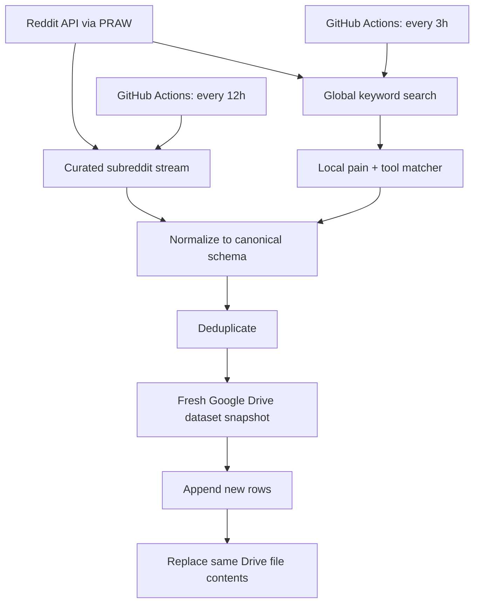

# Technical Documentation

This document describes the implementation, operation and maintenance of the WorkEnablr Reddit Research Scraper.

The repository is responsible for **Reddit data collection, normalization, deduplication and persistence to Google Drive**. Downstream relevance labeling, model training and analytics are intentionally outside the current repository scope.

---

## 1. System responsibilities

The production system has two independent ingestion streams:

1. **Curated subreddit stream**
   - scans 30 configured subreddits;
   - collects every recent post inside the configured lookback window;
   - does not apply pain/tool keyword filtering.

2. **Global Reddit search stream**
   - searches `r/all` using grouped pain + tool queries;
   - splits the configured pain vocabulary into 7 batches;
   - asks Reddit for up to 250 newest search results per batch;
   - applies a local time cutoff;
   - locally verifies that each retained post contains at least one configured pain term and at least one configured tool term.

Both streams ultimately produce rows for the same canonical Google Drive CSV dataset.

The repository does **not**:

- post or comment on Reddit;
- classify final WorkEnablr relevance;
- generate marketing comments;
- train the future relevance model;
- run the future analytics application.

---

## 2. High-level architecture



The Drive dataset is always fetched fresh at the beginning of a pipeline run. Deduplication is performed against that current snapshot before any write occurs.

---

## 3. Repository structure

```text
reddit-research-scraper/
├── .github/
│   └── workflows/
│       ├── global_search_pipeline.yml
│       ├── curated_subreddits_pipeline.yml
│       ├── manual_live_pipeline.yml
│       ├── dry_run_pipeline.yml
│       ├── tests.yml
│       └── diagnostic/test workflows
├── config/
│   └── config.yaml
├── docs/
│   └── TECHNICAL_DOCUMENTATION.md
├── scripts/
│   ├── dry_run_pipeline.py
│   ├── test_drive_connection.py
│   ├── test_reddit_connection.py
│   └── global-search diagnostic scripts
├── src/
│   └── reddit_scraper/
│       ├── scraper.py
│       ├── global_search.py
│       ├── matcher.py
│       ├── cleaning.py
│       ├── deduplication.py
│       ├── drive_storage.py
│       └── pipeline.py
├── tests/
├── .env.example
├── README.md
└── requirements.txt
```

---

## 4. Production execution model

### Global search workflow

Workflow:

```text
.github/workflows/global_search_pipeline.yml
```

Schedule:

```cron
0 */3 * * *
```

This runs every 3 hours in GitHub Actions' UTC cron scheduler.

Command:

```bash
python -m reddit_scraper.pipeline --stream global
```

Configured lookback:

```yaml
global_search_lookback_hours: 6
```

The 6-hour window intentionally overlaps the 3-hour schedule.

### Curated subreddit workflow

Workflow:

```text
.github/workflows/curated_subreddits_pipeline.yml
```

Schedule:

```cron
30 */12 * * *
```

This runs every 12 hours, offset by 30 minutes from the global workflow.

Command:

```bash
python -m reddit_scraper.pipeline --stream curated
```

Configured lookback:

```yaml
subreddit_lookback_hours: 13
```

The 13-hour window creates one hour of intentional overlap.

### Concurrency protection

Both production workflows use:

```yaml
concurrency:
  group: reddit-research-drive-write
  cancel-in-progress: false
```

This is important because both workflows update the same Google Drive CSV file. If jobs overlap, GitHub queues them instead of allowing concurrent writes.

---

## 5. Pipeline execution modes

The pipeline entrypoint supports three stream modes:

```bash
python -m reddit_scraper.pipeline --stream curated
python -m reddit_scraper.pipeline --stream global
python -m reddit_scraper.pipeline --stream both
```

Accepted values are:

- `curated`
- `global`
- `both`

`both` is mainly useful for manual diagnostics and combined testing. Production schedules use the independent stream modes.

### Important write behavior

Running the module normally is a **live run**. If new rows are found, the Drive dataset can be updated.

For a safe read-only end-to-end test, use:

```bash
PYTHONPATH=src python scripts/dry_run_pipeline.py
```

The dry-run script calls the same real Reddit and Drive read paths but passes `dry_run=True`, which disables dataset construction/upload.

---

## 6. Configuration

Main configuration file:

```text
config/config.yaml
```

### Reddit timing

```yaml
reddit:
  subreddit_lookback_hours: 13
  global_search_lookback_hours: 6
```

### Curated communities

The current 30 subreddits are:

```text
sysadmin
SaaS
Notion
webdev
startups
devops
projectmanagers
ProductManagement
clickup
EngineeringManagers
projectmanagement
ExperiencedDevs
businessanalysis
github
sre
softwaredevelopment
jira
mondaydotcom
ITManagers
changemanagement
trello
Slack
Linear
kanban
ProductOwner
agile
managers
atlassian
Asana
scrum
```

Every recent post from these communities is eligible for collection. No keyword filter is used in the curated stream.

### Pain vocabulary

The global search currently tracks 35 pain terms:

```text
blocked
blocker
blockers
waiting on
dependencies
other team
another team
cross-team
handoff
bottleneck
stuck
delays
who owns
no owner
ownership
accountable
assignee
decisions
decision log
meeting notes
rationale
reasoning
reconstruct
source of truth
stale
status reporting
project health
visibility
out of sync
follow-up
chasing
action items
scope change
scattered
fragmented
```

### Tool vocabulary

The current tool terms are:

```text
jira
slack
notion
github
confluence
asana
monday
clickup
linear
teams
spreadsheet
email
```

Some terms are intentionally broad. For example, `teams` may refer to ordinary teams rather than Microsoft Teams, and `monday` may refer to the weekday rather than monday.com. These are candidate-generation terms, not final relevance labels.

---

## 7. Curated subreddit retrieval

Implementation:

```text
src/reddit_scraper/scraper.py
```

### Reddit client

The scraper uses PRAW in read-only mode.

Required environment variables:

```text
REDDIT_CLIENT_ID
REDDIT_CLIENT_SECRET
REDDIT_USER_AGENT
```

### Retrieval behavior

For each configured subreddit:

```python
subreddit.new(limit=None)
```

is traversed newest-first.

The scraper:

1. calculates the UTC cutoff from `subreddit_lookback_hours`;
2. traverses the newest submissions;
3. keeps every post newer than the cutoff;
4. skips an old sticky instead of treating it as the stopping point;
5. stops when it reaches a normal non-sticky post older than the cutoff.

There is no fixed 100-post limit in this stream. If a subreddit contains 130 retrievable posts within the 13-hour window, the intended behavior is to collect all 130.

### Subreddit errors

These PRAW errors are logged and skipped per subreddit:

- `Forbidden`
- `NotFound`
- `Redirect`

Other API/network errors propagate. This is deliberate: an unexpected failure should make the run visibly fail rather than silently look complete while returning partial data.

---

## 8. Global search retrieval

Implementation:

```text
src/reddit_scraper/global_search.py
```

### Search batching

Constants:

```python
DEFAULT_BATCH_SIZE = 5
DEFAULT_SEARCH_LIMIT = 250
```

With 35 pain terms and a batch size of 5, production generates exactly 7 server-side search queries.

Each query has the form:

```text
(pain1 OR pain2 OR pain3 OR pain4 OR pain5)
AND
(tool1 OR tool2 OR ... OR tool12)
```

Terms are quoted before being inserted into the Lucene search expression.

### Reddit search call

Each batch uses:

```python
all_subreddits.search(
    query,
    sort="new",
    syntax="lucene",
    time_filter="day",
    limit=250,
)
```

`250` is a requested maximum, not a guarantee that Reddit will always return exactly 250 results.

### Local cutoff

Server-side search results are then filtered using the exact configured UTC lookback. In production that lookback is 6 hours.

### Local validation

Reddit search is treated only as a discovery mechanism. Every candidate is independently validated by `matcher.py` against the **full** configured pain and tool vocabularies.

The result is retained only if:

```text
at least one exact configured pain term
AND
at least one exact configured tool term
```

Results are deduplicated by Reddit post ID across all seven query batches before leaving `global_search.py`.

---

## 9. Keyword matching semantics

Implementation:

```text
src/reddit_scraper/matcher.py
```

The matcher combines:

```text
title + newline + body
```

Matching is case-insensitive by default.

Terms use this regex boundary structure:

```python
(?<!\w)<escaped term>(?!\w)
```

This avoids loose substring matching.

Example:

```text
blocked by another team  -> matches "blocked"
unblocked                -> does not match "blocked"
```

Multi-word phrases such as `source of truth` are supported.

For qualifying global posts, transient metadata is added:

```text
matched_pain_keywords
matched_tools
```

These fields are useful for diagnostics but are discarded before the canonical dataset row is written.

---

## 10. Canonical dataset schema

Normalization is implemented in:

```text
src/reddit_scraper/cleaning.py
```

The exact canonical column order is:

```text
subreddit
id
title
author
created_utc
created_iso
url
selftext
```

As CSV header:

```csv
subreddit,id,title,author,created_utc,created_iso,url,selftext
```

### Field mapping

Raw scraper fields are converted as follows:

```text
post_id      -> id
text         -> selftext
created_utc  -> created_utc + derived UTC created_iso
```

`author=None` is stored as an empty string.

The original Reddit body is preserved exactly because downstream exact-body deduplication depends on it.

The cleaner rejects rows missing:

- `post_id`
- `subreddit`
- numeric `created_utc`

---

## 11. Deduplication

Implementation:

```text
src/reddit_scraper/deduplication.py
```

Deduplication is intentionally conservative and ordered:

1. exact Reddit `id`;
2. exact non-empty `selftext`.

The system does **not** currently apply:

- lowercase normalization;
- whitespace normalization;
- fuzzy similarity;
- title similarity;
- semantic duplicate detection.

### Why empty body text is ignored

Many Reddit link/image posts have an empty `selftext`. Treating the empty string as a duplicate key would incorrectly collapse unrelated posts.

Therefore:

```text
empty selftext -> deduplicate only by ID
```

### Same-batch duplicates

When a new candidate is accepted, its ID and non-empty body are immediately added to the in-memory seen sets. This means duplicate posts inside the current incoming batch are also removed.

---

## 12. Google Drive persistence

Implementation:

```text
src/reddit_scraper/drive_storage.py
```

Required environment variables:

```text
GOOGLE_SERVICE_ACCOUNT_JSON
GOOGLE_DRIVE_FILE_ID
```

### Authentication

The complete Google service-account credential object is stored as a GitHub secret and loaded from `GOOGLE_SERVICE_ACCOUNT_JSON`.

The application requests the Google Drive scope:

```text
https://www.googleapis.com/auth/drive
```

### Dataset addressing

The scraper never searches Drive by folder name or file name during production execution.

It directly addresses the canonical file using:

```text
GOOGLE_DRIVE_FILE_ID
```

Because the file ID is stable when the existing Drive file is moved between folders, moving the dataset does not require a code/config change. The service account must still retain access after the move.

### Read flow

At the beginning of each pipeline run:

1. authenticate to Drive;
2. download the complete CSV using `files().get_media(fileId=...)`;
3. parse using UTF-8 with BOM support (`utf-8-sig`);
4. validate that the CSV header exactly matches the canonical eight-column schema.

### Append strategy

Existing CSV bytes are preserved.

Only new rows are serialized and appended to the downloaded bytes. Existing historical rows are not reconstructed through pandas or rewritten one by one.

The existing newline convention is preserved.

### Upload strategy

The updated bytes are uploaded with:

```python
service.files().update(
    fileId=file_id,
    media_body=media,
).execute()
```

This replaces the contents of the **same Drive file**, preserving its file ID.

---

## 13. End-to-end pipeline sequence

`run_pipeline()` performs the following sequence:

```text
1. Validate requested stream mode
2. Load config.yaml
3. Authenticate to Google Drive
4. Download current dataset snapshot
5. Create read-only Reddit client
6. Run selected Reddit stream(s)
7. Normalize posts to canonical schema
8. Deduplicate against current Drive rows and current batch
9. If dry-run: log candidates and stop
10. If no unique rows: leave Drive unchanged
11. Otherwise append rows to CSV bytes
12. Replace contents of same Drive file
13. Return PipelineResult counts
```

`PipelineResult` contains:

```text
existing_rows
subreddit_posts
global_search_posts
combined_candidates
unique_posts
uploaded
```

---

## 14. Environment and secrets

Example names are documented in `.env.example`:

```dotenv
REDDIT_CLIENT_ID=
REDDIT_CLIENT_SECRET=
REDDIT_USER_AGENT=

GOOGLE_SERVICE_ACCOUNT_JSON=
GOOGLE_DRIVE_FILE_ID=
```

Never commit real values.

Production values are stored as GitHub Actions secrets:

```text
REDDIT_CLIENT_ID
REDDIT_CLIENT_SECRET
REDDIT_USER_AGENT
GOOGLE_SERVICE_ACCOUNT_JSON
GOOGLE_DRIVE_FILE_ID
```

The repository should never contain:

- Reddit client secrets;
- service-account private keys;
- raw secret JSON;
- personal credentials.

---

## 15. Local development

Recommended Python version:

```text
Python 3.12
```

### Install

```bash
python -m venv .venv
source .venv/bin/activate
pip install -r requirements.txt
```

On Windows PowerShell:

```powershell
.venv\Scripts\Activate.ps1
pip install -r requirements.txt
```

### Configure local environment

Copy:

```bash
cp .env.example .env
```

and populate the required values locally.

`.env` must remain ignored by Git.

### Test Reddit connection

```bash
PYTHONPATH=src python scripts/test_reddit_connection.py
```

### Test Drive connection

```bash
PYTHONPATH=src python scripts/test_drive_connection.py
```

### Run unit tests

```bash
pytest
```

### Run a safe end-to-end dry run

```bash
PYTHONPATH=src python scripts/dry_run_pipeline.py
```

This performs real Reddit and Drive reads but does not upload changes.

### Run production code manually

Only do this when a real Drive write is intended:

```bash
PYTHONPATH=src python -m reddit_scraper.pipeline --stream global
```

or:

```bash
PYTHONPATH=src python -m reddit_scraper.pipeline --stream curated
```

---

## 16. Testing strategy

Automated unit tests live in:

```text
tests/
```

The test suite covers the major pipeline boundaries, including:

- pain + tool matching;
- global query construction and batching;
- exact time cutoff behavior;
- cross-query ID deduplication;
- schema cleaning;
- Drive CSV parsing/appending;
- exact ID/body deduplication;
- independent curated/global pipeline execution;
- dry-run write protection.

GitHub Actions runs the test suite on repository changes through:

```text
.github/workflows/tests.yml
```

Diagnostic workflows and scripts also exist for investigating Reddit search behavior and API assumptions. These should normally remain manual-only.

---

## 17. Failure behavior

### Expected behavior

The pipeline should fail visibly for unexpected infrastructure/API errors rather than silently pretending a partial run was complete.

### Curated subreddit exceptions

A subreddit that is unavailable because of `Forbidden`, `NotFound` or `Redirect` is skipped and logged. The remaining configured subreddits continue.

### Drive schema mismatch

If the Drive CSV header is not exactly the expected schema, parsing raises a `ValueError` and the pipeline does not proceed to upload.

### No new rows

If all retrieved candidates are duplicates:

```text
uploaded = False
```

and the Drive dataset is left unchanged.

### Workflow concurrency

If both scheduled workflows overlap, the shared GitHub Actions concurrency group serializes them. `cancel-in-progress: false` ensures the waiting run is not discarded.

---

## 18. Logging and operational checks

Production logs include:

### Curated stream

Per subreddit:

```text
Retrieved N posts from r/<subreddit> within the last 13 hours
```

### Global stream

Per batch:

```text
Global search batch X/7:
pains=[...]
raw=N
within_lookback=N
new_exact_matches=N
```

Final pipeline output reports:

```text
stream
existing
subreddits
global_search
combined
unique
uploaded
```

Useful operational checks after major changes:

1. confirm the workflow completed successfully;
2. confirm the existing row count was loaded;
3. inspect stream retrieval counts;
4. inspect deduplicated unique count;
5. verify upload state;
6. when testing storage changes, re-read the Drive dataset afterward and verify schema/row count.

---

## 19. Known limitations

### Reddit search is not a complete chronological feed

The global search asks Reddit for results sorted by `new`, but Reddit search indexing can lag or behave inconsistently. The pipeline should not be interpreted as a guaranteed complete archive of every matching Reddit post.

### Per-query search cap

Each global query requests at most 250 candidates. High-volume query groups may therefore have incomplete coverage before the local 6-hour cutoff is applied.

This trade-off is currently accepted for the research use case.

### Broad keyword ambiguity

Terms such as `teams`, `monday`, `email`, `ownership`, `stuck` and similar words can match irrelevant contexts.

The global matcher is a discovery filter, not a semantic relevance model.

### Exact-body deduplication only

Near-identical reposts with small textual changes are not currently collapsed by body matching unless their Reddit IDs are the same.

### No final relevance classification in this repository

A global post can satisfy pain + tool matching and still be irrelevant to WorkEnablr. Final relevance is a downstream task.

---

## 20. Safe maintenance rules

When changing the pipeline:

1. Do not change both retrieval semantics and storage semantics in the same unverified step.
2. Add or update tests first whenever practical.
3. Run the complete unit-test suite.
4. Run a real dry run against Reddit + Drive with writes disabled.
5. Inspect counts and representative candidates.
6. For storage changes, perform a controlled manual live write.
7. Re-download the Drive file and verify:
   - same file ID;
   - same schema;
   - expected row-count increase;
   - no duplicate IDs.
8. Only then enable or modify recurring GitHub Actions schedules.

This staged approach is intentional because the Drive dataset is the cumulative source of truth.

---

## 21. Extending the project

### Add/remove a curated subreddit

Edit:

```text
config/config.yaml -> subreddits
```

No Python change is required.

### Add/remove a pain term

Edit:

```text
config/config.yaml -> pain_keywords
```

Remember that the production batching logic uses groups of 5. Changing the total number of terms may change the number of Reddit queries.

### Add/remove a tool term

Edit:

```text
config/config.yaml -> tools
```

Every global pain batch is combined with the full tool vocabulary.

### Change schedules

Edit the relevant GitHub workflow cron expression:

```text
.github/workflows/global_search_pipeline.yml
.github/workflows/curated_subreddits_pipeline.yml
```

If the cadence changes, re-evaluate the corresponding lookback so the stream still has intentional overlap.

### Move the Drive dataset

Moving the existing file is normally safe because the pipeline uses the Drive file ID. Do not replace it with a copied file unless the `GOOGLE_DRIVE_FILE_ID` secret is intentionally updated.

Always verify that the service account retains file access after a permission/folder change.

---

## 22. Planned downstream architecture

The intended wider research system is:

```text
Reddit
  ↓
this scraper repository
  ↓
Google Drive dataset
  ↓
relevance labeling / training data
  ↓
automated relevance model
  ↓
relevant-post dataset
  ↓
analytics / research application
  ↓
human-reviewed insights and communication
```

The collection layer is already automated. The future model and application should consume the stored dataset without changing the scraper's core responsibility: reliable candidate discovery and persistence.

---

## 23. Dependencies

Current `requirements.txt`:

```text
praw
PyYAML
pandas
google-api-python-client
google-auth
python-dotenv
pytest
```

Main roles:

- **PRAW** — Reddit API access
- **PyYAML** — configuration loading
- **Google API client / google-auth** — Drive access
- **python-dotenv** — local environment loading
- **pytest** — automated testing
- **pandas** — available for supporting scripts/data handling

Dependencies are currently not version-pinned. For stricter reproducibility, pinning or introducing a lockfile would be a reasonable future hardening step.

---

## 24. Operational ownership summary

When investigating a problem, start with the layer that owns it:

| Problem | Primary location |
|---|---|
| Reddit authentication | `scraper.py`, GitHub Reddit secrets |
| Missing curated posts | `scraper.py`, `config.yaml` |
| Global query coverage | `global_search.py`, pain/tool config |
| False lexical matches | `matcher.py`, vocabulary |
| Wrong CSV columns | `cleaning.py`, `drive_storage.py` |
| Duplicate rows | `deduplication.py` |
| Drive read/write failures | `drive_storage.py`, service-account permissions |
| Stream orchestration | `pipeline.py` |
| Scheduling | `.github/workflows/` |
| Regression failures | `tests/` and `tests.yml` |

The design deliberately separates these concerns so failures can be diagnosed without treating the entire system as one mysterious script with opinions.
